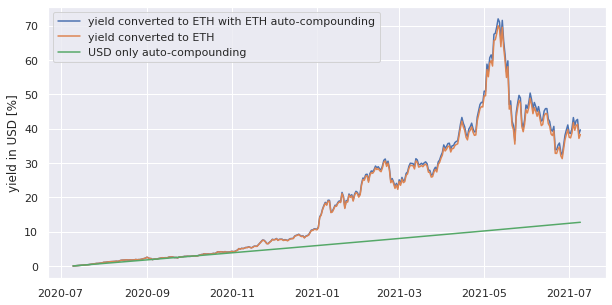
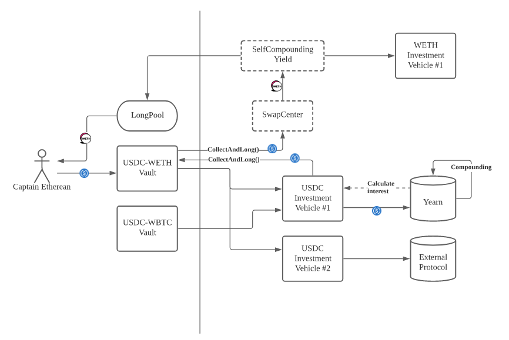

# Vault
## Overview
### Long Vault
With Risk-free Long vault, you deposit stable coins like USDC, DAI into the vault and choose the asset you are bullish about while making the deposit. We invest stable coins into the best opportunities in the market powered by Yearn!

However, instead of reinvesting the profit with the same asset, the Long vault will keep buying in your favourite asset, for example, ETH, BTC.

Since the Long vault continuously buys the asset, the short term
volatility would be neutralized. This strategy has been known as dollar-cost averaging (DCA). Moreover, when the Long vault “longs” an asset, it doesn’t only buy the asset. **The longed asset will be put into a self-compounding vault to earn extra profit for you, thus maximising the capital efficiency.**

Contrary to the normal buy & hold strategy, only the profit from the yield farming is converted to the longed asset. This means **you can always fully redeem the stable coins you deposited no matter the is going up or down.**

What does this mean for your yield? As a simple example, let’s relive the past year and make some assumptions. If the USD based yield is 12.75% and ETH based yield is 5.08% and we have been converting all our USD yield to the one ultra-sound money ETH that we have believed in all along:

(At the time of writing, Yearn’s USDN3CRV vault APY is 12.75%,
stETHCRV vault APY is 5.08%)

Our fiat 12.75% yield has become ~40% ultra-sound yield by the end of the year, and with the self-compounding on your ETH, you gain an extra 1.35% yield.

Could the farmers be doing this by themselves? Absolutely, but because of the gas price, DCA becomes extremely costly, and farmers often need to accumulate their yield so that it is possible to convert them without the gas price taking away most of their profits. Using our Risk-free Long Vault, farmers are now free from short-term volatility, and as long as the asset of your choice is ultra-sound in the long-term, then your yields become ultra-sound too!

### Hodl & Feed
Apart from holding stable coins, there is also another common scenario in yield farming: You hold a token, which can be WETH, WBTC, or governance tokens, and you want to take profit from it from time to time. However, gas price on mainnet is expensive and it often does not make sense for smaller farmers to take profit. The lack of tools to help us taking profits often leave farmers a binary choice: either we continue to Hodl or we had to wait until we accumulate a meaningful amount of the token to realize the profit.

Our Hodl & Feed Vault helps users to Hodl the exact amount of token they have deposited, but take profits as stable coins on the yields. This provides a tool for long-term Hodlers to Hodl an asset while enjoying the sweet yield from stable coins.

## Technical Overview
The product currently makes use of Yearn’s superpower to compound
your yields, when there are enough yields to be converted into the
desired (“longed”) asset, we will collect the profit, process the
conversion, and invest the newly converted asset into an opportunity for you to maximise capital efficiency.

The vault is designed to be versatile, it can invest into multiple investment vehicles at the same time to deploy capital into different opportunities. The Investment Vehicle can also pool funds from multiple vaults and maximise gas efficiency when deploying capital into an opportunity.

## Address
### Vault
- USDC-WETH: 0x24b3f236668448c0b7c5ca4e65798b3f23b660e6
- USDN3CRV-STECRV: 0x1661dB41CA2E36CD0Fc90cb72d1Cf8593AA38fEF
- STECRV-USDN3CRV: 0x93641be25e38fa77b0D19F8e997010581Bfc90a5

### Investment Vehicles
- YEARN_USDC: 0x59645502a430e5dA3289ddb70EF662E0a7FCa17d
- YEARN_USDN3CRV: 0x4eCD6fD80a80dE8aB4a569e76ae6626b1350Eef0
- YEARN_STECRV: 0x9d4141026e7590150a7137529C893e868189917e
- YEARN_WETH:  0xc3066B80D6C6dC0d817751da5dF6cd9920090039

### Self Compounding Yield
- WETH: 0x5e96A1B998491E7db6e30552357D1Fdff41b7Ad3
- USDN3CRV: 0x7057F80913bEA5Cf75C9d65936b303B7fc2974bf
- STECRV: 0xA72486c67Ad49c1355cf8d4666e8e12510054973

### Multi reward asset pool
- USDC-WETH: 0xe9c65c581334e2eee8c86a9f7adbd006d78423e5
- USDN3CRV-STECRV: 0x11257f61c1225b9839c668b6183cdf06c4ef3fd4
- STECRV-USDN3CRV: 0x2d352B9C5cFf7656b06543fe4d9F2B529B799063

## Fee
**Note that LongLong Finance doesn’t charge the withdraw fee in the bootstrapping period, and the funds you deposited during this period will never be charged for the fee in the future.**

The withdraw fee is calculated during deposit. However, you will only be charged for the withdraw fee if you withdraw the funds too soon.

The unsettled withdraw fee is reduced by half every two weeks, and **the fee would be waived if the fund stays in the vault for more than six weeks**. If you withdraw part of the funds early, you will only be charged for the fee corresponds to withdrawn portion. Since fee is calculated during deposit, the unsettled withdraw fee is not subject to any rate adjustment in the future.

For example, if you deposit 1000 USDC into the vault, and the withdraw fee during deposit is 1%, the unsettled withdraw fee will be 1000USDC * 1% = 10USDC. Two weeks later, if you withdraw half of the funds, which is 500 USDC, you will be charged for half of the unsettled withdraw fee. Since it has been two weeks, the unsettled withdraw fee is reduced to 10USDC / 2 = 5 USDC, and half of it (5 USDC / 2 = 2.5USDC) will be applied to the withdraw amount. As a result, you will get 500 USDC – 2.5 USDC = 497.5 USDC. The unsettled withdraw fee becomes 2.5 USDC, and it will be waived as long as you keep the funds in the vault for additional four weeks.

