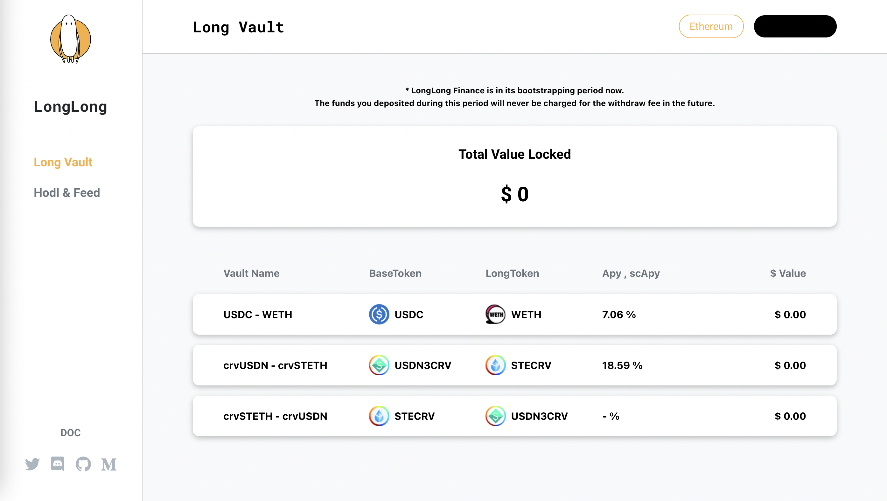
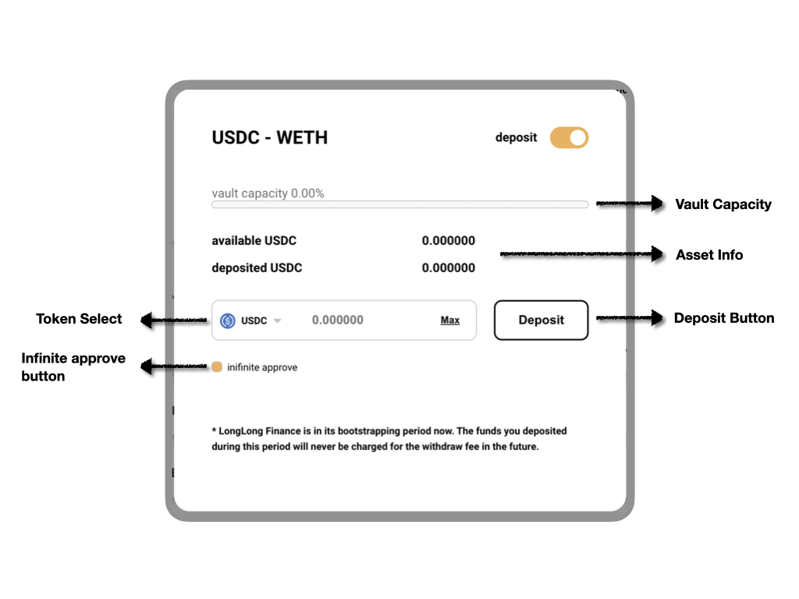
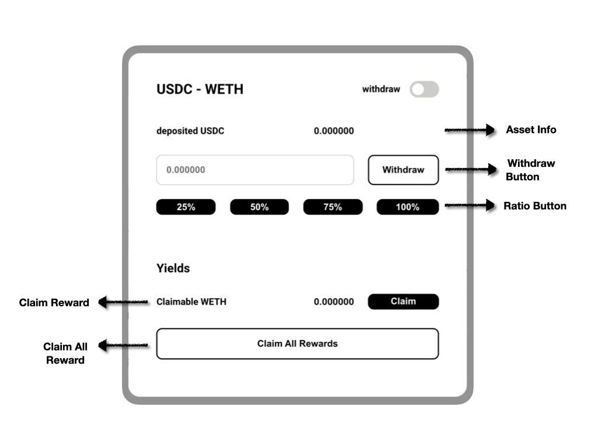

# User Guide

## Deposit
- You can find all vaults on the vault page / hodl& feed page.
- Choose and click on a vault from the list, then you'll see the following pop-up card.
- **Vault Capacity**: For now, we restrict the overall deposit amount to some number, if the capacity is full, you won't be allowed to deposit.
- **Asset Info**: The section show the deposited asset and your token balance.
- **Token Select**: If the vault allows other deposit tokens, you can choose the token from here.
- **Deposit Button**: Click after input the intended deposit amount to send the transaction.
- **Infinite Approve**: If you select infinite approve, we will ask you to approve our smart contract to spend an infinite amount, so you won't have to approve again when you deposit a larger number next time (you can save gas fee by doing so).

## Withdraw
- Click the toggle on the top-right corner, then you'll see the withdraw and claim options.
- **Asset Info**: The section show the deposited asset, which is the amount you can withdraw.
- **Ratio Button**: You can click on the ration button, the respective amount will be filled in the input area.
- **Withdraw Button**: Click after you input the withdraw amount to withdraw.

## Claim Yields
- This is where you can claim your Yields!
- **Claim Reward**: This is where you can find your claimable rewards, you can choose to claim individual rewards by clicking the claim button.
- **Claim All Rewards**: By clicking this button, you can claim all your rewards at once.

